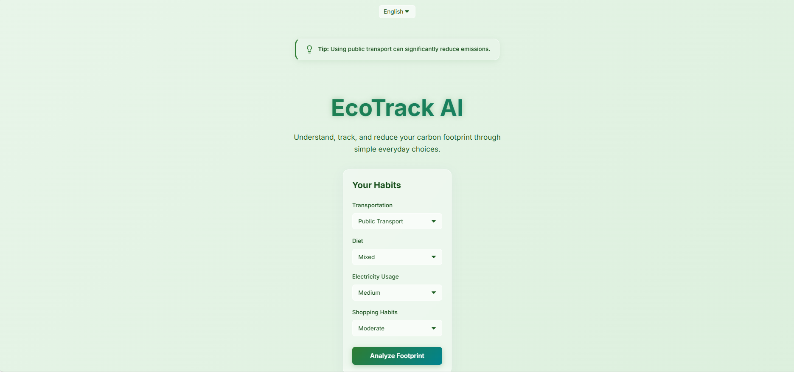
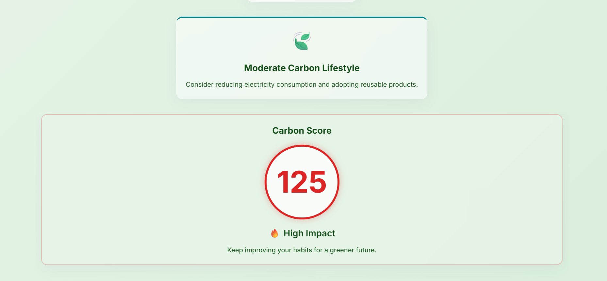
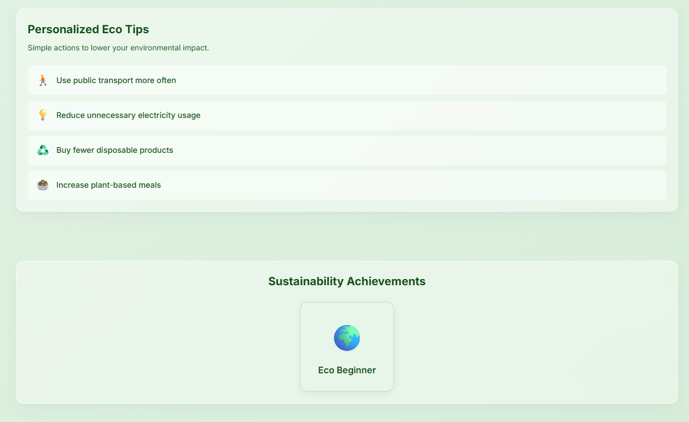
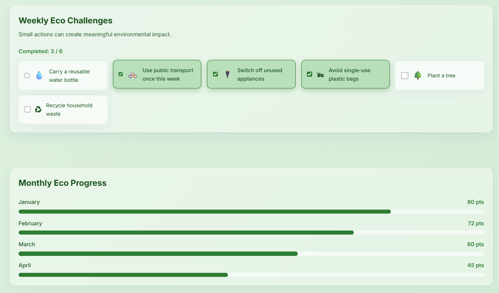
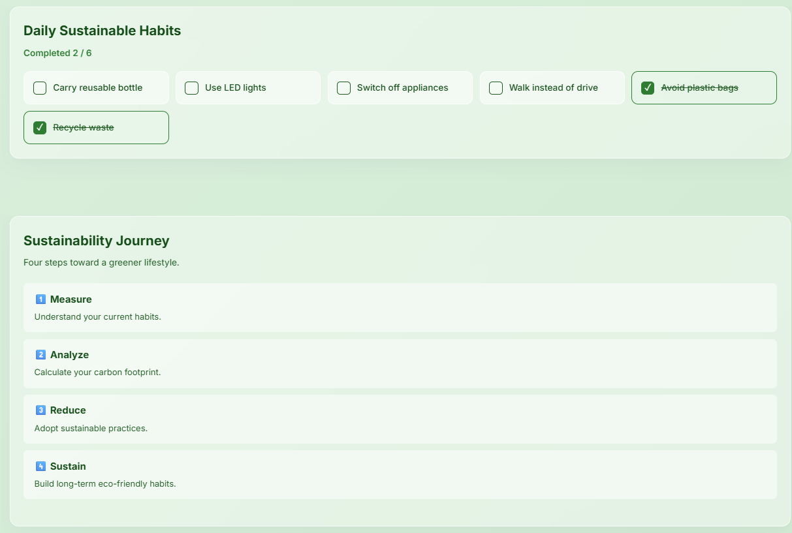
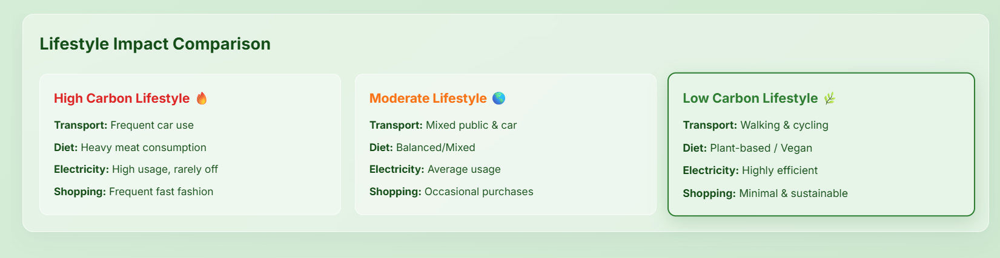
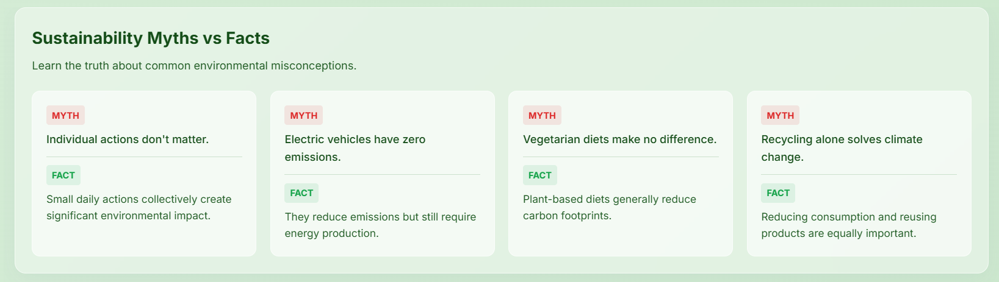
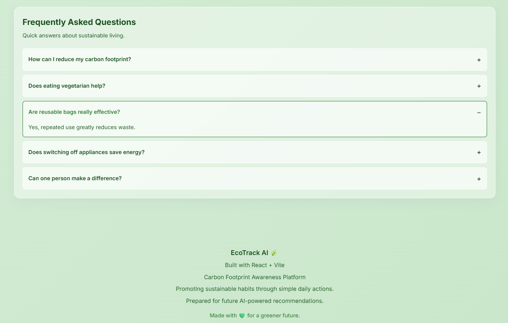

# 🌿 EcoTrack AI

> Understand, track, and reduce your carbon footprint through simple everyday choices.


---

## 🌎 About

**EcoTrack AI** is a Carbon Footprint Awareness Platform built for the **Prompt Wars Virtual Bi-Weekly Hackathon by Google**.

The platform helps individuals understand, track, and reduce their environmental impact through simple actions and personalized recommendations.

---

## 🚀 Live Demo

🔗 **Live Website:**
https://ecotrack-ai-514374581163.asia-south1.run.app/

---

## ✨ Features

* 🌿 Carbon Footprint Analysis
* 📊 Carbon Score Calculator
* 💡 Personalized Eco Tips
* 🏆 Sustainability Achievements
* ✅ Weekly Eco Challenges
* 📈 Monthly Progress Tracker
* 🌱 Daily Sustainable Habits
* 🛤 Sustainability Journey Timeline
* 🌍 Lifestyle Impact Comparison
* 📚 Sustainability Myths vs Facts
* ❓ Frequently Asked Questions
* 🌐 Multilingual Support (English, Hindi, Odia)
* 📱 Responsive Design
* ♿ Accessibility Friendly
* ⚡ Smooth Animations and Glassmorphism UI

---

# 🛠 Tech Stack

* React
* Vite
* JavaScript
* CSS
* Vitest
* React Testing Library
* Google Cloud Run

---

# 📂 Project Structure

```bash
src/
│
├── components/
├── utils/
├── assets/
├── App.jsx
├── index.css
└── main.jsx

public/
│
└── screenshots/
    ├── 01_Home_Habits_Input.png
    ├── 02_Carbon_Analysis_Result.png
    ├── 03_Eco_Tips_Achievements.png
    ├── 04_Challenges_Progress_Tracker.png
    ├── 05_Daily_Habits_Journey.png
    ├── 06_Lifestyle_Impact_Comparison.png
    ├── 07_Myths_vs_Facts.png
    └── 08_FAQ_Footer.png
```

---

# 📸 Screenshots

## 🏠 Home & Habits Input



---

## 🌿 Carbon Analysis Result



---

## 💡 Personalized Eco Tips & Achievements



---

## 📈 Challenges & Progress Tracker



---

## 🌱 Daily Habits & Sustainability Journey



---

## 🌍 Lifestyle Impact Comparison



---

## 📚 Sustainability Myths vs Facts



---

## ❓ FAQ & Footer



---

# ⚙ Installation

Clone the repository:

```bash
git clone https://github.com/harshitmohantas131-png/ecotrack-ai.git
```

Move into the project directory:

```bash
cd ecotrack-ai
```

Install dependencies:

```bash
npm install
```

Start development server:

```bash
npm run dev
```

---

# 🔨 Build for Production

```bash
npm run build
```

---

# ☁ Deployment

This project is deployed using **Google Cloud Run**.

```bash
gcloud builds submit --tag gcr.io/PROJECT_ID/ecotrack-ai

gcloud run deploy ecotrack-ai \
--image gcr.io/PROJECT_ID/ecotrack-ai \
--platform managed \
--region asia-south1 \
--allow-unauthenticated
```

---

# 🧪 Testing

Run tests:

```bash
npm run test
```

All tests pass successfully ✅

---

# 🎯 Project Objective

EcoTrack AI aims to promote sustainable habits by making carbon footprint awareness simple, interactive, and accessible to everyone.

Users can:

* Measure their impact
* Analyze lifestyle choices
* Reduce emissions
* Sustain greener habits

---

# 🌱 Future Improvements

* 🤖 AI-powered recommendations
* 📅 Weekly reports
* ☁ Cloud Firestore integration
* 👤 User accounts and login
* 📊 Historical analytics dashboard
* 🌳 Carbon offset suggestions

---

# 👨‍💻 Developer

**Harshit Mohanta**

B.Tech CSE (Software Product Engineering)
Lovely Professional University × Kalvium


---

## 💚 Made with React + Vite for a Greener Future 🌿

### Built for Prompt Wars Virtual Bi-Weekly Hackathon by Google 🚀
